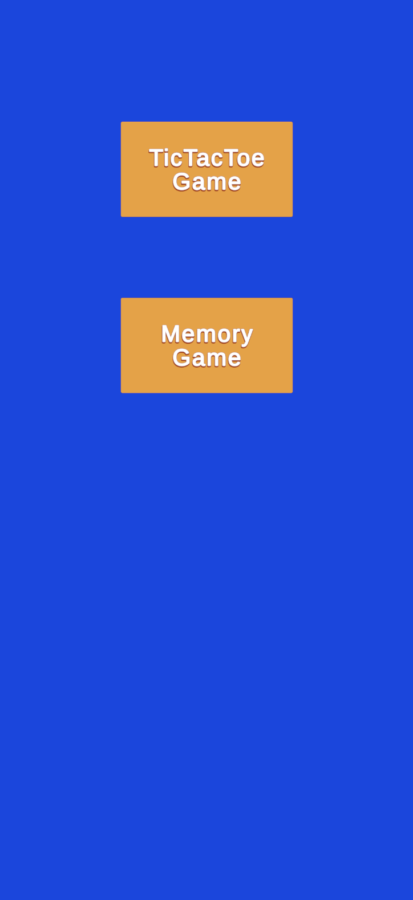

# 🎮 Unity Case Study

<p align="center">
  
  &nbsp; &nbsp;
  
  &nbsp; &nbsp;
  
</p>

## 📦 General Features

* The project is modular, consisting of:

  * **Common Libraries**
  * **Home Screen**
  * **Mini Games**
* Core services and managers:

  * **AssetManager**: Simplifies asset loading.
  * **SignalBus**: Implements an observer pattern for communication between modules; supports both generic and game-specific signals.
  * **GlobalSignalBus**: Enables communication between mini games and the Home Screen.
  * **GridManager**: Eases development of grid-based games.
  * **Input Handlers**: Supports mouse and touch input (`click`, `tap`, `hold`, `swipe`, etc.).
  * **FileManager**: Simplifies file I/O operations.
  * **UserStorage**: Stores and retrieves user profile data.
  * **ProgressStorage**: Stores and manages generic progress data.
  * **PoolService**: Provides object pooling to improve performance.
  * **PopupService**: Manages creation of both generic and game-specific popup panels.
  * **SceneLoader**: Manages scene transitions with loading screens.
  * **JsonSerializer**: Wrapper for Unity `JsonUtility`.

> ✅ **Note:** `GridManager` and `InputHandlers` are configurable using `IGridConfig` and `IInputConfig`.

---

## 🏗️ Development

* **Unity Version**: 6.0.47
* **Build Platform**: iOS
* **Initial Scene**: MainScene
* **Display**: iPhone 11 Pro - Portrait

---

## 📚 Third-Party Libraries

* **[Zenject](https://github.com/modesttree/Zenject)**: Used for dependency injection.
* **[UniTask](https://github.com/Cysharp/UniTask)**: Lightweight async/await framework optimized for Unity.
* **[DOTween](http://dotween.demigiant.com/)**: Used for smooth animations.

---

## 🕹️ Mini Games

Two mini games are implemented:

### ✖️ TicTacToe

* Classic turn-based game.
* Player places an "X", followed by a randomly-placed "O" from the computer.
* Consists of a **single level**, but player’s **level number increases upon winning**.

### 🧠 Memory Game

* Standard memory matching game.
* Player must match all cards before running out of moves.
* Also consists of a **single level** with level number increasing after a win.

---

## 🏗️ Architecture

* The **Home Screen** is the main scene where players choose which game to play.

* On game selection:

  * The **game scene is loaded and initialized**.
  * The HomeScreen **canvas is disabled (but not destroyed)**.
  * A **loading screen** appears during scene transition.

* Each mini game has an **EntryPoint module**, responsible for:

  * Loading **user profile data**.
  * Loading **progress data**.
  * Building the game level.

* **Player progress** (e.g., current level) is persisted via `ProgressStorage`.

* When a player **quits a game**:

  * The game scene is **destroyed**.
  * The Home Screen is reactivated.

* This approach allows:

  * The **ProjectContext** (from Zenject) to persist.
  * Mini games to use isolated **SceneContexts** and cleaning up of services easily.

### 🧩 Additional Notes

* Reusable **popup panels** and **signals** are shared across games.
* **Logic and views are separated** for maintainability.
* **Object pooling** is used to optimize long gameplay sessions.

---

## 🧪 Unit Testing

* Unit tests are written for the `InputBlocker` class.
* Test file path:

  ```
  Assets/Tests/Editor/InputBlockerTests.cs
  ```

---

## 🚀 Future Improvements

* **User profile data** is currently loaded by each game; this should be moved to the **Home Screen** to avoid re-loading every time.
* **Popup panels** can be pooled for better memory efficiency.
* A **completion block mechanism** could be added to delay the win/lose popups until animations are completed.
* Improvements to **GridManager** to support more types of grid-based games.
* An **http library** to communicate with backend services.

---

## 💡 Tips & Tricks

* The games are very lightweight, so loading screens are very short.
* To simulate a loading delay, each EntryPoint module includes a **fake delay of 400ms**.

